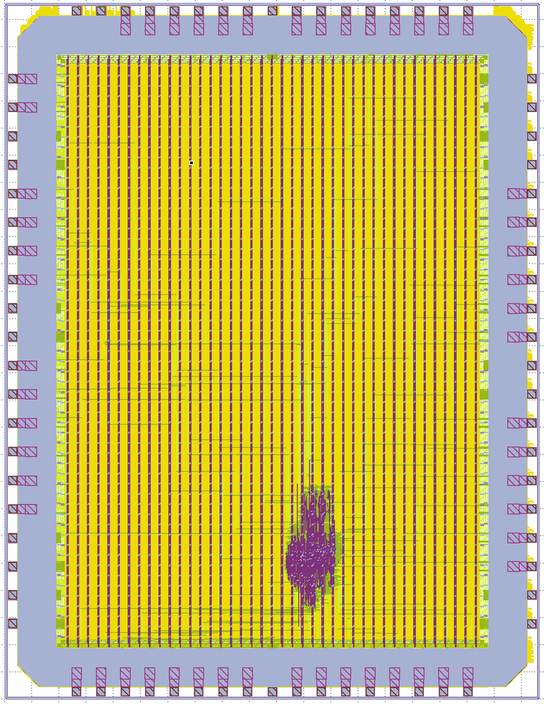

# Silicon clone of Zilog's Z80 for fabrication with Global Foundry 180 nm process via Wafer.space MPW.

Base code repository: https://github.com/rejunity/z80-open-silicon

<p align="center" width="100%">
    
</p>

## Wafer Space + Global Foundry 180 nm

To know more about budget silicon manufacturing: https://wafer.space

## Prerequisites

We use a custom fork of the [gf180mcuD PDK variant](https://github.com/wafer-space/gf180mcu) until all changes have been upstreamed.

To clone the latest PDK version, simply run `make clone-pdk`.

In the next step, install LibreLane by following the Nix-based installation instructions: https://librelane.readthedocs.io/en/latest/installation/nix_installation/index.html

## Implement the Design

This repository contains a Nix flake that provides a shell with the [`leo/gf180mcu`](https://github.com/librelane/librelane/tree/leo/gf180mcu) branch of LibreLane.

Simply run `nix-shell` in the root of this repository.

> [!NOTE]
> Since we are working on a branch of LibreLane, OpenROAD needs to be compiled locally. This will be done automatically by Nix, and the binary will be cached locally. 

With this shell enabled, run the implementation:

```
make librelane
```

## View the Design

After completion, you can view the design using the OpenROAD GUI:

```
make librelane-openroad
```

Or using KLayout:

```
make librelane-klayout
```

## Copying the Design to the Final Folder

To copy your latest run to the `final/` folder in the root directory of the repository, run the following command:

```
make copy-final
```

This will only work if the last run was completed without errors.

## Verification and Simulation

We use [cocotb](https://www.cocotb.org/), a Python-based testbench environment, for the verification of the chip.
The underlying simulator is Icarus Verilog (https://github.com/steveicarus/iverilog).

The testbench is located in `cocotb/chip_top_tb.py`. To run the RTL simulation, run the following command:

```
make sim
```

To run the GL (gate-level) simulation, run the following command:

```
make sim-gl
```

> [!NOTE]
> You need to have the latest implementation of your design in the `final/` folder. After implementing the design, execute 'make copy-final' to copy all necessary files.

In both cases, a waveform file will be generated under `cocotb/sim_build/chip_top.fst`.
You can view it using a waveform viewer, for example, [GTKWave](https://gtkwave.github.io/gtkwave/).

```
make sim-view
```

## Choosing a Different Slot Size

The template supports the following slot sizes: `1x1`, `0p5x1`, `1x0p5`, `0p5x0p5`.
By default, the design is implemented using the `1x1` slot definition.

To select a different slot size, simply set the `SLOT` environment variable.
This can be done when invoking a make target:

```
SLOT=0p5x0p5 make librelane
```

Alternatively, you can export the slot size:

```
export SLOT=0p5x0p5
```

You can change the slot that is selected by default in the Makefile by editing the value of `DEFAULT_SLOT`.

## Precheck

To check whether your design is suitable for manufacturing, run the [gf180mcu-precheck](https://github.com/wafer-space/gf180mcu-precheck) with your layout.
